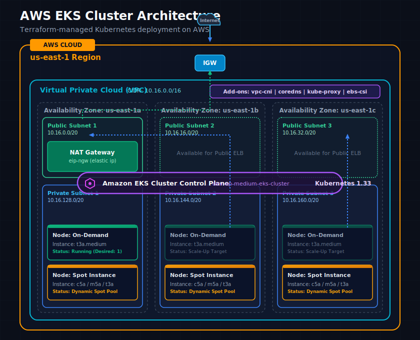

# EKS Cluster Terraform Project

This repository provisions an Amazon EKS cluster with networking, IAM roles, add-ons, and worker nodes using Terraform.

## Workflow



## Prerequisites

- Terraform 1.15.7 or newer
- AWS CLI configured with valid credentials
- An AWS account with permissions to create VPC, IAM, EKS, and EC2 resources

## Project structure

- eks/ - Terraform configuration, backend settings, and variable definitions
- module/ - reusable Terraform modules for VPC, IAM, EKS, and node groups
- eks/dev.tfvars - example values for the development environment

## How to run

From the repository root, change into the Terraform directory:

```bash
cd eks
```

Initialize Terraform:

```bash
terraform init
```

Preview the infrastructure changes:

```bash
terraform plan -var-file=dev.tfvars
```

Apply the changes:

```bash
terraform apply -var-file=dev.tfvars -auto-approve
```

To remove the resources later:

```bash
terraform destroy -var-file=dev.tfvars -auto-approve
```

Optional checks:

```bash
terraform fmt -recursive
terraform validate
```

If you want to use a remote backend, update the backend configuration in [eks/backend.tf](eks/backend.tf).
